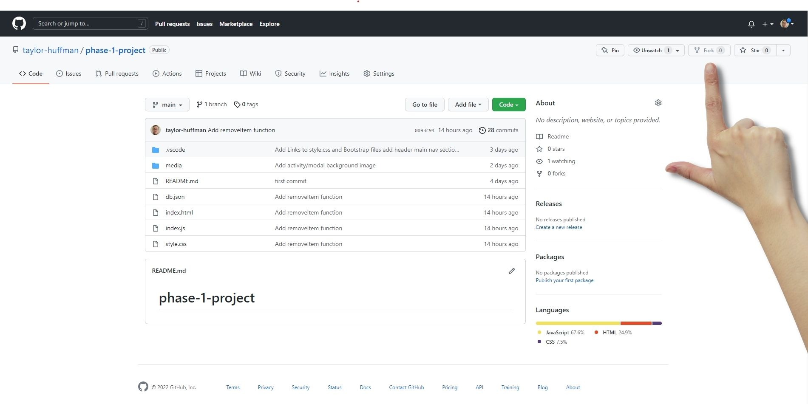
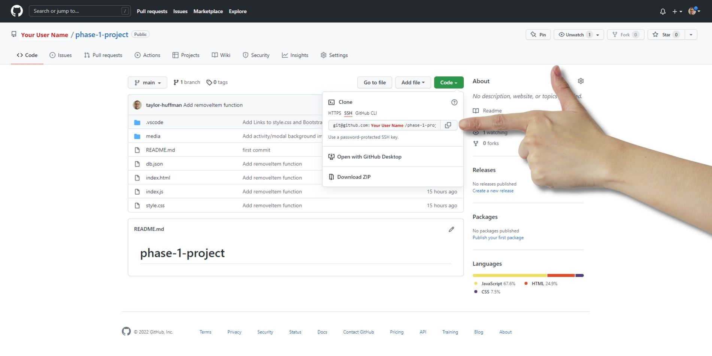
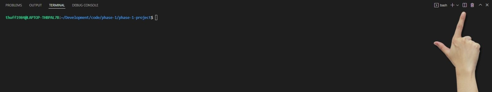
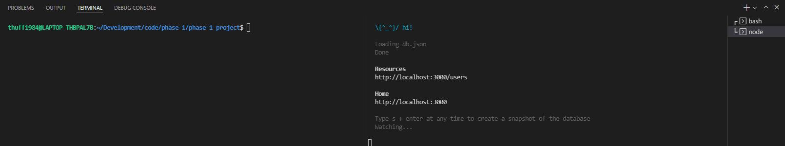

# Goodbye, Boredom. - An activity suggestion app

## Description
Goodbye, Boredom. came about to fill a need for users feeling trapped in a state of boredome. Often it is hard to come up with things to do when you are so extremely bored, so I developed an app to draw the user in and output random activities they can partake in to rid themselves of boredom.

## Getting Started
Start by forking the project



Next, grab your SSH key. (Make sure you see your user name where the red text is)



Next, navigate to your desired folder in Ubuntu and type in the following command to clone your newly created repo, making sure your username is taking place of 'your-user-name' in the url:

```
git clone git@github.com:your-user-name/phase-1-project.git
```

Then, navigate to the root folder of the project:

```
cd phase-1-project/
```

Once in the root folder, copy and paste the following command to open VS Code:

```
code .
```

Once VS Code is open, click " Ctrl + ` " to open the VS Code terminal. Then click the icon shown in the picture to split the terminal.



On either side of the split terminal, type in the following command. This will open a node terminal and display the json server:

```
json-server --watch db.json
```

It Should look something like this:



Once the server is running, open the index.html file with the following command in the terminal

```
explorer.exe index.html
```

Excellent! You did it! You're now ready to operate the app! Please proceed to the operation instructions.

## Operation Instructions
This app is pretty straight-forward and intuitive. Follow simple instructions below to operate the app.

Navigate to your browser tab that has index.html open.

Start by entering your name.

Once you've entered your name, simply click the button 'Click For A Suggested Activity' to show an activity.

Click as many time as you want until you find an activity that you want to proceed with and then click the button 'Add To My Activities'.

At any time, feel free to click on 'Goodbye, Boredom.' at the top left to return to the home screen. Also, click on the graph icon on the top right to show your selected activities as well the most popular activity amongst all users.

Have fun curing your boredom!

## Media Credits
Illustrations from [Openpeeps.com](https://www.openpeeps.com/) and created by Pablo Stanley

## Contact Me For Questions
Have any questions? Feel free to shoot me an email: [taylor@crucialartists.com](mailto:taylor@crucialartists.com)

## Known Bugs/Deficiencies
Current Deficiencies:
When clicking on the graph icon to show users selected activities, each activity shows an 'X' to remove the item from their list. The item currently gets removed from the DOM but these changes do not persist as the changes are not made to the database. I plan to make this functional in the future.
